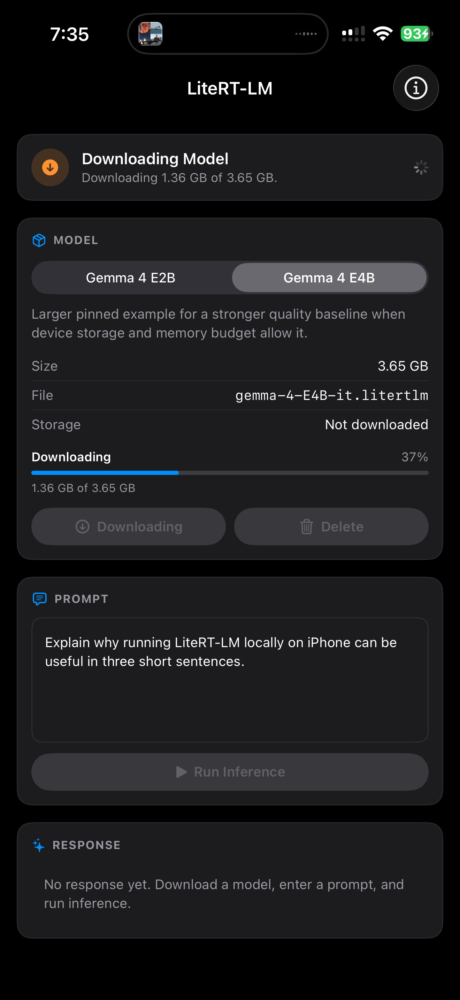
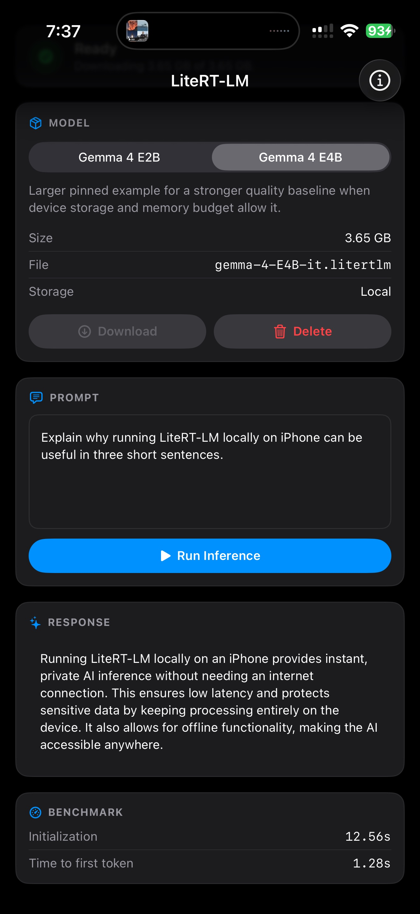

# LiteRT-LM-Apple

[](https://dl.circleci.com/status-badge/redirect/gh/rogerioth/liteRT-LM-Apple/tree/main)
[](https://sonarcloud.io/summary/new_code?id=rogerioth_liteRT-LM-Apple)

If you want to run LiteRT-LM models inside an iPhone, iPad, Apple Vision Pro, Mac, or Mac Catalyst app, but you do not want to spend your time packaging upstream Apple binaries by hand, this repository is for you.

`LiteRT-LM-Apple` gives you a Swift Package Manager-friendly way to integrate the upstream LiteRT-LM Apple C API into Xcode. You get prebuilt XCFrameworks, a thin package surface, a reproducible rebuild pipeline, and a working sample app that downloads a model locally and runs on-device inference.

If your practical goal is to run Gemma 4 on an iPhone, iPad, Apple Vision Pro, or Apple Silicon Mac, this repository gives you a direct path to do that in a native SwiftUI app.

## Why This Repo Exists

The upstream LiteRT-LM repository is source-first. This repository is integration-first.

If you are evaluating on-device LLM inference for Apple platforms, you usually want to answer questions like these quickly:

- Can I add this to my Xcode project today?
- Can I test model download and inference without inventing my own sample app first?
- Can I rebuild the packaged Apple artifacts later without guessing which Bazel steps matter?

This repo is designed to let you answer "yes" to all three.

## What You Get

- a Swift package product named `LiteRTLMApple`
- prebuilt `LiteRTLMEngineCPU.xcframework`, `LiteRtMetalAccelerator.xcframework`, and `GemmaModelConstraintProvider.xcframework`
- direct access to the upstream `engine.h` C API from Swift and Objective-C
- official package support for iOS, visionOS, Apple Silicon macOS, and Apple Silicon Mac Catalyst
- a complete SwiftUI sample app for local model download and single-turn inference on iPhone, iPad, Apple Vision Pro, native Mac, and Mac Catalyst
- a practical baseline for running Gemma 4 locally on Apple devices
- focused markdown documentation under `docs/` for integration, maintenance, and troubleshooting
- structured Xcode console logging in the sample app so you can see runtime and download failures clearly
- a one-command rebuild pipeline for refreshing the package from the pinned upstream revision

## Who This Is For

This repository is a good fit if you want:

- on-device LLM inference in an iOS, visionOS, or macOS app
- a Swift Package Manager dependency instead of a custom Xcode binary import flow
- a thin wrapper around upstream LiteRT-LM, not a large opinionated SDK
- a reproducible way to rebuild the Apple artifacts when upstream changes

This repository is probably not what you want if you are looking for:

- a full high-level chat SDK
- bundled models inside the package
- training, fine-tuning, or server-side inference tooling

## Quick Start

### Add The Package From GitHub

If you want to integrate this package into another app, use the GitHub repository URL and a tagged release.

- repository URL: `https://github.com/rogerioth/liteRT-LM-Apple.git`
- current release: `v0.3.0`

This branch's sample app intentionally resolves the package from `main` over GitHub SPM so the example tracks the latest unreleased package state (visionOS support, multimodal image input) until the next tag is cut.

In Xcode:

1. Open your project.
2. Choose `File` -> `Add Package Dependencies...`.
3. Enter `https://github.com/rogerioth/liteRT-LM-Apple.git`.
4. Select `Up to Next Minor Version`.
5. Set the version to `0.3.0`.
6. Link the `LiteRTLMApple` product to your app target.

In `Package.swift`:

```swift
dependencies: [
    .package(url: "https://github.com/rogerioth/liteRT-LM-Apple.git", from: "0.3.0")
]
```

Then import the package:

```swift
import LiteRTLMApple
```

### Prefer A Local Checkout?

If you want to inspect or modify the package while integrating it, you can add the repository as a local package instead:

1. Open your Xcode project.
2. Choose `File` -> `Add Package Dependencies...`.
3. Click `Add Local...`.
4. Select this repository.
5. Link the `LiteRTLMApple` product to your app target.

## What Integration Looks Like

The package intentionally stays close to the upstream LiteRT-LM C API. If you want low-level control, you still have it. The sample app wraps that surface in `LiteRTLMRuntime`, which most apps can either use directly or copy as a starting point.

A single-turn call from Swift looks like this:

```swift
import LiteRTLMApple

let runtime = LiteRTLMRuntime()
let result = try await runtime.generateResponse(
    modelURL: modelURL,
    cacheDirectory: cacheDirectory,
    inputs: InferenceInputs(prompt: "What is this?", imageData: pngData),
    options: LiteRTLMRuntimeOptions()
)
```

`LiteRTLMRuntimeOptions()` ships with safe defaults validated for Gemma 4 image inference on Apple devices (GPU main, CPU vision for Gemma 4 image prompts, FP16 main activations, 384-token cap). To run a diagnostic configuration, mutate the struct fields before calling:

```swift
var options = LiteRTLMRuntimeOptions()
options.visionBackend = .gpu                       // override Gemma 4 default
options.visionActivationDataType = .float32        // correct embeddings, large memory
options.minLogLevel = .info                        // see runtime startup logs
let result = try await runtime.generateResponse(
    modelURL: modelURL, cacheDirectory: cacheDirectory,
    inputs: inputs, options: options
)
```

If you want lower-level control, the upstream C API is fully exposed through the package. The sample app's `LiteRTLMRuntime.swift` is the canonical example of how to drive it from Swift, including model download, cache management, JSON encoding, response extraction, and benchmark collection.

## Sample App

The example project in `Examples/LiteRTLMAppleExample/` shows the complete path most developers care about first:

- choose a pinned LiteRT-LM model
- download the `.litertlm` asset into local app storage
- initialize the engine with a cache directory
- run on-device inference from SwiftUI
- inspect structured `print` logs in the Xcode console

On this branch, the sample is configured as a universal SwiftUI app for iPhone, iPad, Apple Vision Pro, native Mac, and Mac Catalyst. Open it in Xcode and choose `My Mac`, `Apple Vision Pro`, a Mac Catalyst destination, or an iOS destination to exercise the same flow.

The current sample app includes pinned Gemma 4 examples:

- `Gemma 4 E2B` at about `2.58 GB`
- `Gemma 4 E4B` at about `3.65 GB`

That makes this repository a useful starting point if you want to put Gemma 4 directly on Apple hardware instead of routing inference through a server.

The sample runtime applies these defaults through `LiteRTLMRuntimeOptions()`:

- main executor: `.gpu`
- vision backend: `.cpu` for Gemma 4 image prompts (E2B and E4B both produce semantically wrong embeddings on the Metal FP16 vision encoder; the FP32 path exceeds iOS cold-start memory limits when paired with the GPU main executor); `.gpu` for non-Gemma-4 image prompts when main is GPU; not instantiated for text-only prompts
- `max_num_images`: `1`
- `mainActivationDataType`: `.float16` on GPU main
- `maxNumTokens`: `384` on GPU main
- E4B-only: main `gpuConvertWeightsOnGpu = false` (lower cold-start memory)
- main GPU `gpuCacheCompiledShadersOnly = true`
- vision GPU `cacheCompiledShadersOnly = true` when vision is GPU
- session `max_output_tokens`: `256`
- benchmark collection: enabled

There are no environment-variable overrides. Per-call tuning happens through `LiteRTLMRuntimeOptions`; setting any field bypasses the runtime's model-aware default for that field.

Open it here:

```text
Examples/LiteRTLMAppleExample/LiteRTLMAppleExample.xcodeproj
```

If you want to point the sample at different models, update:

`Examples/LiteRTLMAppleExample/LiteRTLMAppleExample/ModelCatalog.swift`

## Multimodal

The sample app can attach a photo and ask Gemma 4 about it. Click `Attach Image` in the Prompt card, choose a photo from your Photos library, click the `"What is this?"` chip (or type your own prompt), and run inference. Picker output is EXIF-transformed, downscaled to a 1024-pixel longest edge, and re-encoded as PNG before reaching the engine, so HEIC photos from iOS work uniformly and large phone photos stay in the vision path that matches Edge Gallery.

The Conversation API on the C surface accepts user messages with mixed image and text content parts:

```json
{"role":"user","content":[
  {"type":"image","blob":"<base64-png>"},
  {"type":"text","text":"What is this?"}
]}
```

If you build directly against the C API (rather than going through `LiteRTLMRuntime`), these settings must be in place before creating the engine on a vision-capable model:

1. Pass `"cpu"` (or `"gpu"`) for `vision_backend_str` in `litert_lm_engine_settings_create` — passing `NULL` skips vision-executor instantiation and the first image content part will crash.
2. Call `litert_lm_engine_settings_set_max_num_images(settings, 1)` (or higher). The default of `0` causes the prefill graph to fail with a `DYNAMIC_UPDATE_SLICE` shape mismatch.
3. For the GPU main executor, set the main activation type to `FLOAT16` (`1`) and cap `max_num_tokens` to `384`. Higher GPU token budgets can exceed device memory on the current public Gemma 4 artifacts.
4. For Gemma 4 image prompts, prefer `vision_backend_str = "cpu"`. The GPU vision encoder on Metal currently runs in FP16 (the C wrapper's memory-saving default) and produces semantically wrong embeddings for Gemma 4 — the dog test photo is described as "a crowd of people" or "a person's face". Forcing FP32 vision GPU restores correctness but exceeds iOS cold-start memory limits when paired with the GPU main executor.

Leave `prefill_chunk_size` at its model-driven default for vision prompts. Avoid overriding `max_num_tokens` or `prefill_chunk_size` unless you know the model artifact supports the requested shape.

## Screenshots

<p align="center">
  
  
</p>

These screenshots show the current example app flow for selecting a local model, downloading it to the device, and running on-device inference from SwiftUI.

## Why Developers Use This Instead Of Wiring Up Upstream Directly

You can absolutely integrate LiteRT-LM by starting from upstream. This repository is useful when you want to move faster and keep the Apple packaging work out of your application repository.

In practice, that means:

- you do not need to manually export the Apple shared engine dylib yourself
- you do not need to manually build and package XCFrameworks before trying the API
- you still keep access to the original upstream C surface
- you can refresh the package from a pinned upstream revision with one public entrypoint

## Rebuilding The Package

If you need to refresh the checked-in binaries or repackage the library from the pinned upstream LiteRT-LM revision, use:

```bash
./scripts/buildall.sh
```

That script orchestrates the internal subscripts and runs the full pipeline:

1. clones LiteRT-LM into `.worktree/LiteRT-LM`
2. checks out the pinned upstream revision
3. fetches the required Git LFS-backed iOS prebuilts
4. applies the local Apple export patch
5. builds iOS device, iOS simulator, and macOS dylibs with `bazelisk`
6. derives an Apple Silicon Mac Catalyst slice from the iOS simulator dylib because upstream does not ship a dedicated Catalyst binary yet
7. derives visionOS device and simulator slices from the packaged iOS outputs because upstream does not ship dedicated visionOS dylibs yet
8. creates fresh XCFrameworks
9. refreshes the public `engine.h` header exposed by this package

### Requirements

- `git`
- `git-lfs`
- `bazelisk`
- `xcodebuild`
- Xcode command line tools

Updated outputs land in:

- `Artifacts/LiteRTLMEngineCPU.xcframework`
- `Artifacts/LiteRtMetalAccelerator.xcframework`
- `Artifacts/GemmaModelConstraintProvider.xcframework`
- `Sources/LiteRTLMApple/include/engine.h`

## Repository Layout

| Path | Purpose |
| --- | --- |
| `Package.swift` | Swift Package definition |
| `Sources/LiteRTLMApple/include/engine.h` | Public upstream C header exposed to Swift and Objective-C |
| `Artifacts/` | Prebuilt XCFramework artifacts consumed by the package |
| `patches/0001-export-ios-shared-engine-dylib.patch` | Local patch applied before packaging |
| `scripts/buildall.sh` | Public one-pass rebuild entrypoint |
| `scripts/subscripts/` | Internal clone, patch, build, and packaging helpers |
| `docs/` | Extra markdown documentation and screenshots for developers evaluating the package |
| `Examples/LiteRTLMAppleExample/` | SwiftUI sample app for download and inference |

## Documentation

If you want a deeper view than the main README, start here:

- [`docs/README.md`](docs/README.md) for the documentation index
- [`docs/integration-guide.md`](docs/integration-guide.md) for package integration guidance
- [`docs/sample-app.md`](docs/sample-app.md) for the example app structure and extension points
- [`docs/maintenance-guide.md`](docs/maintenance-guide.md) for rebuild and release workflow details
- [`docs/troubleshooting.md`](docs/troubleshooting.md) for common simulator, build, and model-size issues

## Related Repositories

If you want the official upstream sources and the broader Google reference apps around this ecosystem, these are the most relevant repositories:

- [`google-ai-edge/LiteRT-LM`](https://github.com/google-ai-edge/LiteRT-LM) is the upstream LiteRT-LM project this package is built from.
- [`google-ai-edge/gallery`](https://github.com/google-ai-edge/gallery) is Google's on-device ML and GenAI gallery app, which is a useful reference if you want to see how Google presents and experiments with local model experiences.

## Versioning

Swift Package Manager resolves this package from Git tags. If you are integrating it into another project, use a tagged release instead of an arbitrary commit when possible.

Current published release:

- `v0.3.0`

## Upstream Pin

- upstream repository: `https://github.com/google-ai-edge/LiteRT-LM.git`
- pinned revision: `7d1923daaaa1e5143f77f0adb105188e53e8485e`
- configuration source: `scripts/subscripts/common.sh`

## Compatibility Notes

- The package manifest declares `iOS 13.0`, `macOS 14.0`, and `visionOS 1.0`.
- The package supports iOS, visionOS, Apple Silicon native macOS, and Apple Silicon Mac Catalyst.
- The checked-in iOS simulator, visionOS simulator, Mac Catalyst, and macOS XCFramework slices are `arm64` only.
- The current `GemmaModelConstraintProvider` iOS simulator and Mac Catalyst slices have a minimum iOS-family version of `26.2`, so recent simulator or Catalyst runtimes, a real iOS device, or a native Mac build are the safest validation paths.
- The current Mac Catalyst slice is derived from the Apple Silicon iOS simulator dylib because upstream does not publish a dedicated Catalyst binary yet.
- The current visionOS device and simulator slices are derived from the packaged iOS device and iOS simulator dylibs because upstream does not publish dedicated visionOS binaries yet.
- The current checked-in visionOS slices have a minimum version of `1.0`.
- The current checked-in macOS slice has a minimum version of `14.0`.
- The sample app is a reference integration, not a production framework.
- Large LiteRT-LM model files require meaningful disk space and are better evaluated on real hardware when you care about latency.

## License

This repository is licensed under the Apache License 2.0. That matches both:

- [`google-ai-edge/LiteRT-LM`](https://github.com/google-ai-edge/LiteRT-LM)
- [`google-ai-edge/gallery`](https://github.com/google-ai-edge/gallery)

See [`LICENSE`](LICENSE) for the full text.

## If You Want To Start Fast

If your goal is simply to prove that LiteRT-LM can run in your iOS environment, do this:

1. Add the package from GitHub.
2. Open the sample app.
3. Download `Gemma 4 E2B`.
4. Watch the Xcode console while the model downloads and initializes.
5. Use that working path as your baseline before you build your own runtime layer.

That is the shortest path from "interesting repo" to "working on-device inference in Xcode."
